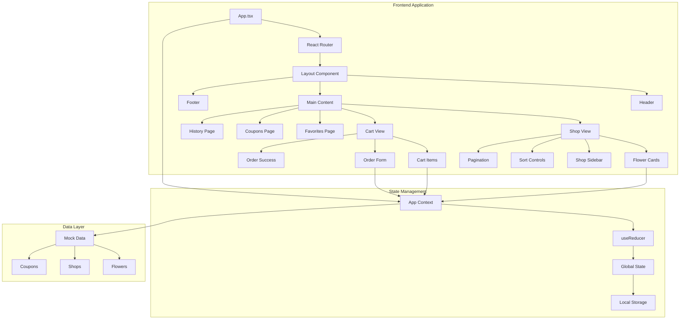
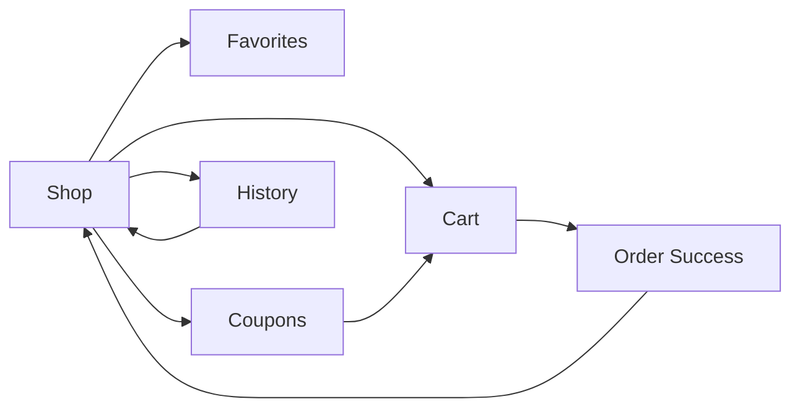
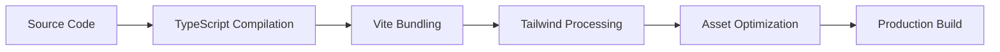

# 🏗️ Architecture Documentation

## System Overview

The Flower Delivery App is built using a modern React architecture with TypeScript, following best practices for scalability, maintainability, and performance.

## 📊 Architecture Diagram



## 🔧 Component Architecture

### Component Hierarchy

```
App
├── Router
└── Layout
    ├── Header
    │   ├── Navigation Links
    │   ├── Cart Counter
    │   └── Favorites Counter
    ├── Main Content (Outlet)
    │   ├── ShopView
    │   │   ├── ShopSidebar
    │   │   ├── SortControls
    │   │   ├── FlowerCard[]
    │   │   └── Pagination
    │   ├── CartView
    │   │   ├── CartItem[]
    │   │   ├── OrderForm
    │   │   └── OrderSuccess
    │   ├── FavoritesPage
    │   │   └── FlowerCard[]
    │   ├── CouponsPage
    │   │   └── CouponCard[]
    │   └── HistoryPage
    │       └── Order History Items
    └── Footer
        ├── Company Info
        ├── Quick Links
        ├── Customer Service
        └── Contact Info
```

### Component Responsibilities

#### Layout Components
- **Layout**: Main wrapper, provides consistent structure
- **Header**: Navigation, branding, cart/favorites counters
- **Footer**: Company information, links, contact details

#### Feature Components
- **ShopView**: Main shopping interface with filtering and sorting
- **CartView**: Shopping cart management and checkout
- **FavoritesPage**: Display user's favorite flowers
- **CouponsPage**: Coupon management and application
- **HistoryPage**: Order history with search functionality

#### UI Components
- **FlowerCard**: Individual flower display with actions
- **CartItem**: Cart item with quantity controls
- **CouponCard**: Coupon display with copy/apply actions
- **Pagination**: Navigation through large datasets
- **OrderForm**: Customer information and order submission
- **OrderSuccess**: Order confirmation display

## 🔄 State Management

### Context Architecture

```typescript
interface AppState {
  flowers: Flower[];           // All available flowers
  cart: CartItem[];           // Shopping cart items
  selectedShop: string | null; // Current shop filter
  sortBy: SortOption;         // Current sort option
  orders: Order[];            // Order history
  appliedCoupons: Coupon[];   // Applied discount coupons
  currentPage: number;        // Pagination state
  itemsPerPage: number;       // Items per page
}
```

### Action Types

```typescript
type AppAction =
  | { type: 'SET_SELECTED_SHOP'; payload: string | null }
  | { type: 'SET_SORT_BY'; payload: SortOption }
  | { type: 'TOGGLE_FAVORITE'; payload: string }
  | { type: 'ADD_TO_CART'; payload: Flower }
  | { type: 'REMOVE_FROM_CART'; payload: string }
  | { type: 'UPDATE_CART_QUANTITY'; payload: { flowerId: string; quantity: number } }
  | { type: 'CLEAR_CART' }
  | { type: 'ADD_ORDER'; payload: Order }
  | { type: 'APPLY_COUPON'; payload: Coupon }
  | { type: 'REMOVE_COUPON'; payload: string }
  | { type: 'SET_CURRENT_PAGE'; payload: number };
```

### Data Flow

1. **User Interaction** → Component dispatches action
2. **Action** → Reducer processes state change
3. **State Update** → Context provides new state
4. **Component Re-render** → UI reflects new state
5. **Side Effects** → Local storage updates

## 💾 Data Persistence

### Local Storage Strategy

```typescript
// Cart persistence
useEffect(() => {
  setStoredCart(state.cart);
}, [state.cart, setStoredCart]);

// Favorites persistence
useEffect(() => {
  setStoredFlowers(state.flowers);
}, [state.flowers, setStoredFlowers]);
```

### Storage Keys
- `flower-cart`: Shopping cart items
- `flower-favorites`: Flower favorite states

## 🎨 Styling Architecture

### Tailwind CSS Utility Classes

```css
/* Component-specific patterns */
.flower-card {
  @apply bg-white rounded-xl shadow-md overflow-hidden 
         transition-all duration-300 hover:shadow-xl hover:-translate-y-1;
}

.button-primary {
  @apply bg-gradient-to-r from-purple-500 to-pink-500 
         text-white px-4 py-2 rounded-lg font-medium 
         transition-all duration-200 hover:shadow-md;
}
```

### Design System

#### Color Palette
```css
:root {
  --primary-purple: #8b5cf6;
  --primary-pink: #ec4899;
  --secondary-indigo: #6366f1;
  --success-green: #10b981;
  --warning-yellow: #f59e0b;
  --error-red: #ef4444;
  --neutral-gray: #6b7280;
}
```

#### Spacing System
- Base unit: 4px (0.25rem)
- Scale: 4px, 8px, 12px, 16px, 20px, 24px, 32px, 40px, 48px, 64px

#### Typography Scale
- xs: 12px
- sm: 14px
- base: 16px
- lg: 18px
- xl: 20px
- 2xl: 24px
- 3xl: 30px
- 4xl: 36px

## 🔀 Routing Architecture

### Route Structure

```typescript
const routes = [
  {
    path: "/",
    element: <Layout />,
    children: [
      { index: true, element: <ShopView /> },
      { path: "cart", element: <CartView /> },
      { path: "favorites", element: <FavoritesPage /> },
      { path: "coupons", element: <CouponsPage /> },
      { path: "history", element: <HistoryPage /> }
    ]
  }
];
```

### Navigation Flow



## 🔍 Search and Filtering

### Filter Architecture

```typescript
const filteredFlowers = useMemo(() => {
  let filtered = state.flowers;
  
  // Shop filter
  if (state.selectedShop) {
    filtered = filtered.filter(flower => 
      flower.shopId === state.selectedShop
    );
  }
  
  // Sort logic
  return filtered.sort((a, b) => {
    switch (state.sortBy) {
      case 'name': return a.name.localeCompare(b.name);
      case 'price-low': return a.price - b.price;
      case 'price-high': return b.price - a.price;
      case 'date': return new Date(b.dateAdded) - new Date(a.dateAdded);
      case 'favorites': return b.isFavorite - a.isFavorite;
    }
  });
}, [state.flowers, state.selectedShop, state.sortBy]);
```

## 📱 Responsive Design

### Breakpoint Strategy

```css
/* Mobile First Approach */
.container {
  @apply px-4;                    /* Mobile: 16px padding */
  @apply sm:px-6;                 /* Small: 24px padding */
  @apply md:px-8;                 /* Medium: 32px padding */
  @apply lg:px-12;                /* Large: 48px padding */
  @apply xl:px-16;                /* Extra Large: 64px padding */
}

/* Grid Responsive Patterns */
.flower-grid {
  @apply grid grid-cols-1;        /* Mobile: 1 column */
  @apply sm:grid-cols-2;          /* Small: 2 columns */
  @apply lg:grid-cols-3;          /* Large: 3 columns */
  @apply xl:grid-cols-4;          /* Extra Large: 4 columns */
}
```

### Mobile Optimizations
- Touch-friendly button sizes (minimum 44px)
- Optimized image loading with responsive sizes
- Simplified navigation for mobile screens
- Swipe gestures for pagination

## 🚀 Performance Optimizations

### Code Splitting

```typescript
// Route-based code splitting
const ShopView = lazy(() => import('./components/ShopView'));
const CartView = lazy(() => import('./components/CartView'));
const FavoritesPage = lazy(() => import('./pages/FavoritesPage'));
```

### Memoization Strategy

```typescript
// Expensive calculations
const filteredFlowers = useMemo(() => {
  // Complex filtering and sorting logic
}, [state.flowers, state.selectedShop, state.sortBy]);

// Component memoization
const FlowerCard = memo(({ flower }) => {
  // Component implementation
});
```

### Image Optimization
- Pexels URLs with compression parameters
- Responsive image loading
- Lazy loading for off-screen images

## 🔒 Security Considerations

### Input Validation

```typescript
const validateForm = (): boolean => {
  const newErrors: Partial<CustomerInfo> = {};
  
  if (!customerInfo.name.trim()) {
    newErrors.name = 'Name is required';
  }
  
  if (!customerInfo.email.trim()) {
    newErrors.email = 'Email is required';
  } else if (!/^[^\s@]+@[^\s@]+\.[^\s@]+$/.test(customerInfo.email)) {
    newErrors.email = 'Please enter a valid email';
  }
  
  return Object.keys(newErrors).length === 0;
};
```

### XSS Prevention
- React's built-in XSS protection
- Sanitized user inputs
- Controlled component patterns

## 📊 Monitoring and Analytics

### Performance Metrics
- First Contentful Paint (FCP)
- Largest Contentful Paint (LCP)
- Cumulative Layout Shift (CLS)
- First Input Delay (FID)

### User Analytics
- Page views and navigation patterns
- Cart abandonment rates
- Conversion funnel analysis
- Popular products and categories

## 🔧 Development Workflow

### Build Process



### Quality Assurance

```bash
# Type checking
npm run type-check

# Linting
npm run lint

# Testing
npm run test

# Build verification
npm run build && npm run preview
```

## 🔮 Scalability Considerations

### Future Architecture Enhancements

1. **State Management**: Consider Redux Toolkit for complex state
2. **API Integration**: Replace mock data with REST/GraphQL APIs
3. **Caching**: Implement React Query for server state management
4. **Testing**: Add comprehensive unit and integration tests
5. **Monitoring**: Integrate error tracking and performance monitoring
6. **Deployment**: Set up CI/CD pipelines for automated deployment

### Microservices Readiness
- Modular component architecture
- Clear separation of concerns
- API-ready data layer
- Independent feature modules

This architecture provides a solid foundation for a production-ready e-commerce application with room for future enhancements and scaling.